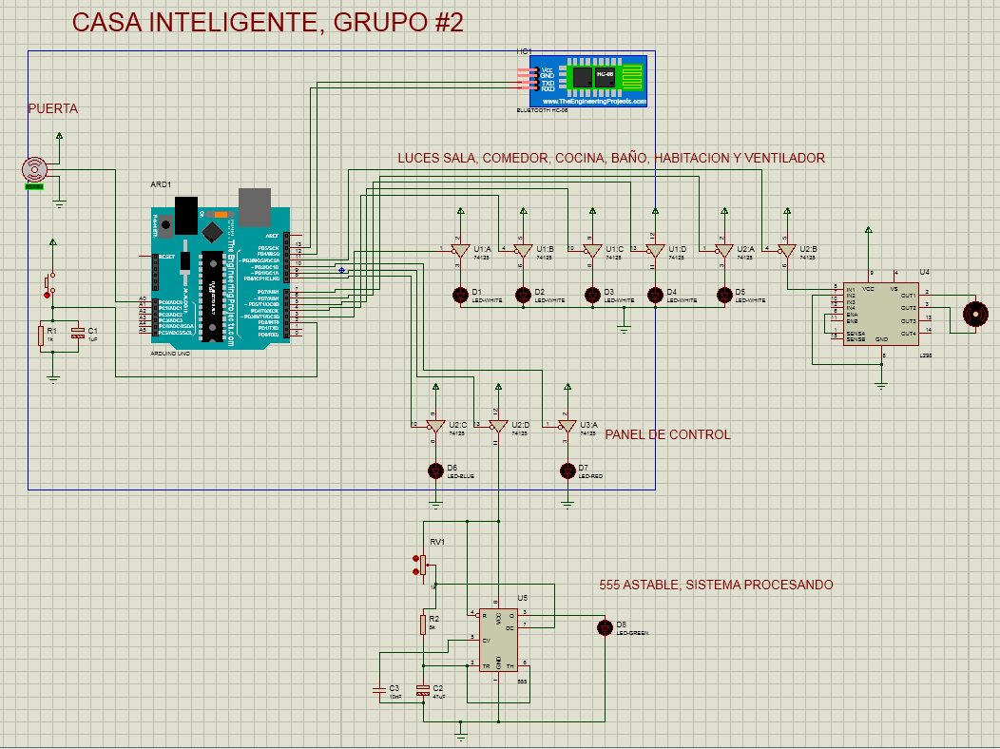
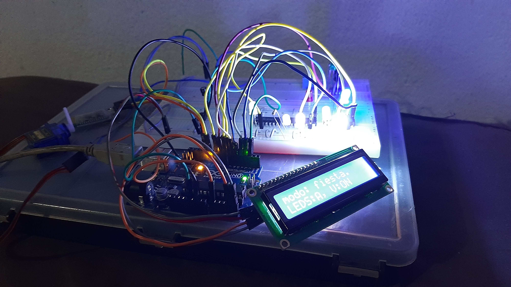
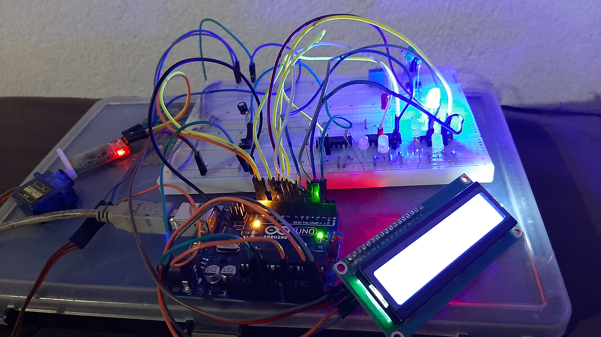
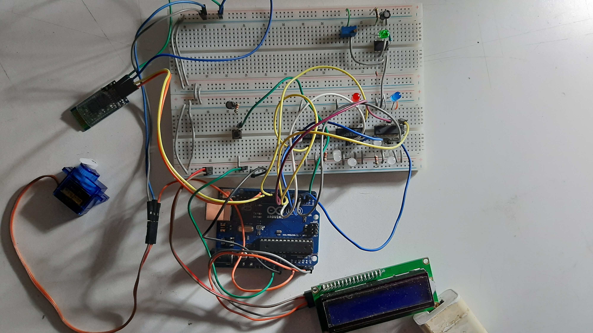
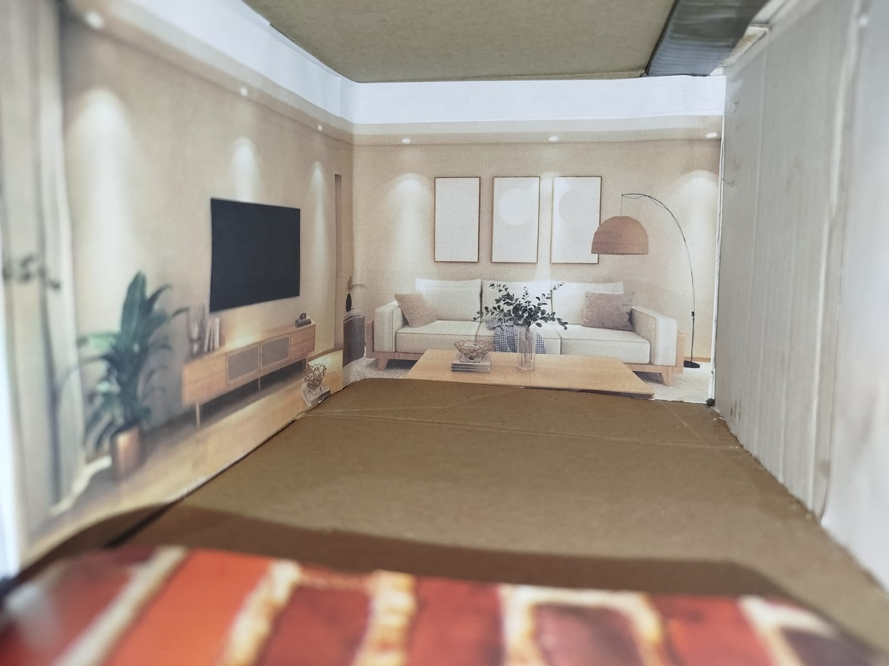
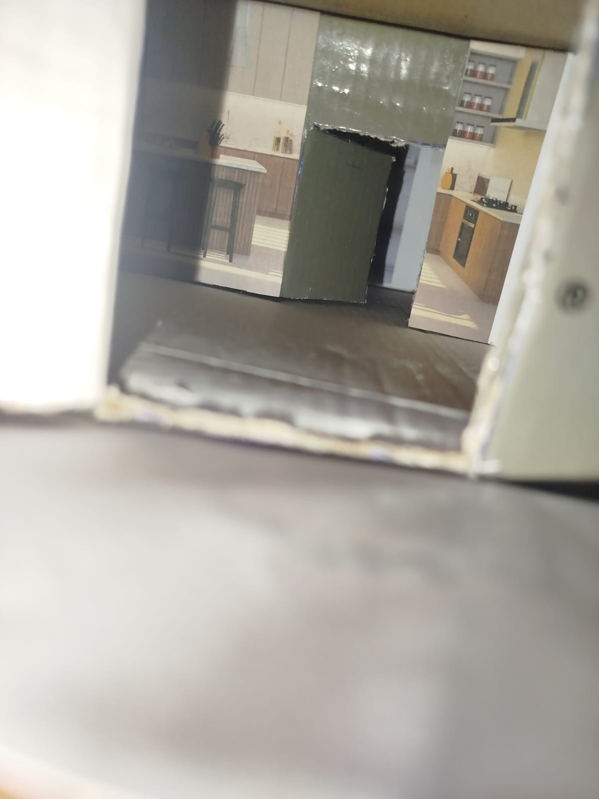
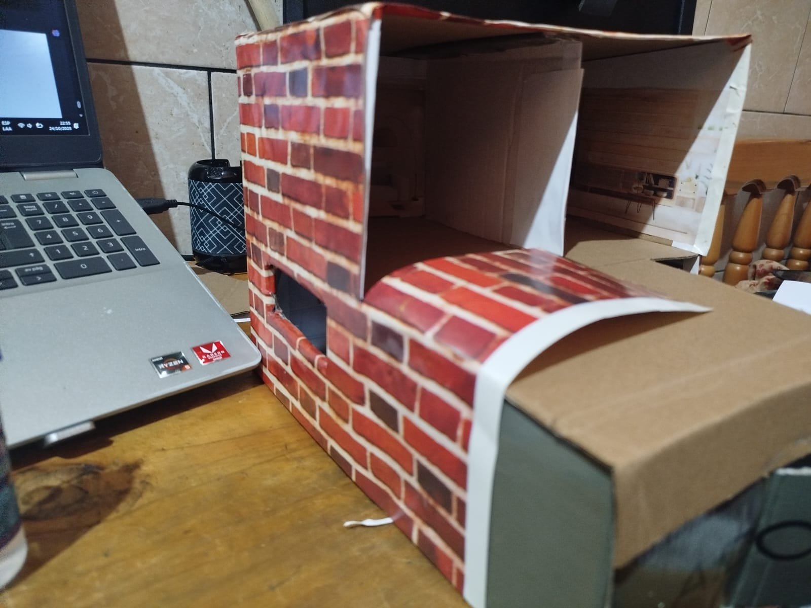

# 🏫 Universidad San Carlos de Guatemala
# 🏗️ Facultad de Ingeniería
# 💻 Ingeniería en Ciencias y Sistemas
# 🔌 Organización Computacional


---

## **🔐 Proyecto Final: Casa Inteligente con Control de Ambientes y Ventilador Automatizado.**

**Grupo:** G2  
**Semestre:** Segundo Semestre 2025

**👥 Integrantes:**
-  GARY DANIEL URIZAR GARCIA - 202101146
- WILSON WILFREDO PEREZ OTZOY - 202300697
- WALTER MANUEL MENDOZA PÉREZ - 202106830

**Auxiliar:** Juan Pablo Garcia Ceballos 
**Catedrático:** Ing. Otto Rene Escobar Leiva

**Fecha de Entrega:** 24/10/2025

---

<div align="center">

*"¡Id y enseñar a todos!"*

</div>

# INTRODUCCION

## El proyecto `Casa Inteligente con Control de Ambientes y Ventilador Automatizado` tiene como propósito diseñar e implementar un sistema automatíco integral que permita gestionar de manera centralizada y remota los dispositivos electrónicos de una vivienda. Utilizando un microcontrolador Arduino como núcleo de control, en este caso se utilizó un Arduino 1, el sistema integra una matriz de iluminación distribuida en cinco ambientes (sala, comedor, cocina, baño y habitación), un ventilador simulado mediante un motor DC, una puerta automatizada con servomotor y una interfaz de configuración basada en archivos de texto (.org). Además, incorpora comunicación Bluetooth para el control remoto desde dispositivos móviles utilizando la aplicacion "Serial Bluetooth Terminal" y una pantalla LCD para retroalimentación en tiempo real.

## Este proyecto demuestra la aplicación práctica de conceptos de organización computacional, sistemas embebidos, gestión de memoria no volátil (EEPROM) y comunicación serial, abordando desafíos técnicos como la sincronización de dispositivos, la validación de comandos y la persistencia de configuraciones.

# OBJETIVOS

## Objetivo General:
### Diseñar e implementar una maqueta funcional de una casa inteligente que permita configurar, almacenar y ejecutar escenas predefinidas para el control de iluminación, ventilación y acceso, integrando microcontroladores, memoria EEPROM, comunicación Bluetooth y una interfaz de usuario intuitiva.

## Objetivos Específicos:

1. Implementar un sistema de almacenamiento en memoria EEPROM para guardar configuraciones de escenas luminosas y estados de dispositivos, garantizando su persistencia tras reinicios del sistema.

2. Desarrollar una interfaz de configuración mediante archivos .org, permitiendo cargar, validar y procesar escenas personalizadas desde una computadora hacia el Arduino.

3. Integrar un módulo Bluetooth para el control remoto de los ambientes y dispositivos desde un dispositivo móvil, sincronizando las salidas físicas (LEDs, motor DC, servomotor) con la retroalimentación visual en la pantalla LCD y los indicadores LED.

# DIAGRAMA ESQUEMATICO



*Figura 1: A continuación se adjunta el diagrama esquemático del circuito. Elaborao con Proteus, 2025*


# CODIGO FUENTE DE ARDUINO

```arduino
/**
  Casa Inteligente con
  Control de Ambientes y
  Ventilador Automatizado.

  Proyecto final de organización computacional.
  2do. Semestre 2025
  Seccion B
  Grupo #2

  Nota: Para este proyecto se implementó el
  74HC125 (buffer tri-estado) para controlar
  las luces de las habitaciones y el panel de
  estado.
*/

#include <Wire.h>
#include <LiquidCrystal_I2C.h>
#include <SoftwareSerial.h>
#include <EEPROM.h>
#include <Servo.h>

// Pines
const byte BTN_PUERTA             = 2,
          LED_SALA                = 3,
          LED_COMEDOR             = 4,
          LED_COCINA              = 5,
          LED_BANIO               = 6,
          LED_HABITACION          = 7,
          LED_AZUL                = 8,  // Sistema funcional
          LED_VERDE               = 9,  // Procesando informacion
          LED_ROJO                = 10, // Error encontrado
          VENTILADOR_HABITACION   = 11,
          TX_BT                   = 12,
          RX_BT                   = 13,
          SERVO_PUERTA            = A0;

// Variables
bool puertaAbierta          = false;
bool activarModoAlternante  = false;
bool cambioAlternante       = false;
String mensajeModoFiesta    = "Modo: FIESTA",
       mensajeModoRelajado  = "Modo: RELAJADO",
       mensajeModoNoche     = "Modo: NOCHE";

// Constantes
const byte SISTEMA_FUNCIONAL    = 0,
           PROCESANDO           = 1,
           ERROR                = 2;
const String CMD_MODO_FIESTA    = "modo_fiesta",
             CMD_MODO_RELAJADO  = "modo_relajado",
             CMD_MODO_NOCHE     = "modo_noche",
             CMD_ENCENDER_TODO  = "encender_todo",
             CMD_APAGAR_TODO    = "apagar_todo";


// Objetos
Servo servoPuerta;
SoftwareSerial BT(TX_BT, RX_BT);
LiquidCrystal_I2C lcd(0x27, 16, 2);

// Estructuras

// Prototipos
void abrirCerrarPuerta();
void ejecutarComando(String comando);
void imprimirLCD(String msgFila1, String msgFila2);
void estadoPanelLED(byte estado);
void modoAlternante(bool cambio);
void encenderLuces();
void apagarLuces();
void encenderVentilador();
void apagarVentilador();
void mensajeBievenida();
void aplicarEstado(byte estado, String *mensaje1);
void aplicarEstado(byte estado, String *mensaje1, String *mensaje2);
void ping();
void procesarConfiguracion();
void mensajeConexionPC();
void mensajeOK();
void errorSintaxis();
void errorEEPROM();
void errorDesconocido();
void aplicarConfigPerfil(String *nombrePerfil, String *mensajeLCD, byte *leds, byte *ventilador);


void setup() {
  // put your setup code here, to run once:
  lcd.init();
  lcd.backlight();
  lcd.clear();
  lcd.setCursor(0,0);

  pinMode(BTN_PUERTA, INPUT);
  pinMode(LED_SALA, OUTPUT);
  pinMode(LED_COMEDOR, OUTPUT);
  pinMode(LED_COCINA, OUTPUT);
  pinMode(LED_BANIO, OUTPUT);
  pinMode(LED_HABITACION, OUTPUT);
  pinMode(VENTILADOR_HABITACION, OUTPUT);
  pinMode(LED_AZUL, OUTPUT);
  pinMode(LED_VERDE, OUTPUT);
  pinMode(LED_ROJO, OUTPUT);
  servoPuerta.attach(SERVO_PUERTA);
  Serial.begin(9600);
  BT.begin(9600);

  servoPuerta.write(0);

  mensajeBievenida();
  estadoPanelLED(SISTEMA_FUNCIONAL);
  apagarLuces();
  apagarVentilador();
}

void loop() {
  // put your main code here, to run repeatedly:
  if (Serial.available()>0) {
    String mensaje = Serial.readString();
    mensaje.trim();
    if (mensaje.equals("ping")) { // CONEXION DE PRUEBA
      Serial.print("pong");
    }
    else if (mensaje.equals("PC")) { // CONEXION DE CONFIGURACIÓN
      apagarLuces();
      apagarVentilador();
      servoPuerta.write(0);
      mensajeConexionPC();
      procesarConfiguracion();
    }

  } else if (BT.available()>0) {
    String comando = BT.readString();
    comando.trim();
    ejecutarComando(comando);

  } else if (digitalRead(BTN_PUERTA) == HIGH) {
    abrirCerrarPuerta();

  } else if (activarModoAlternante) {
    modoAlternante(cambioAlternante);
    delay(500);
    cambioAlternante = !cambioAlternante;
  }
}


/************************************************************************************
  FUNCIONES PARA COMANDOS Y BOTONES
*************************************************************************************/

/*
  Ejecuta los comandos que son recibidos por el modulo
  bluetooth.
*/
void ejecutarComando(String comando) {
  byte index = 0;
  String mensaje1 = "";
  String mensaje2 = "";

  if (comando.equals(CMD_MODO_FIESTA)) {
    index = 0;

  } else if (comando.equals(CMD_MODO_RELAJADO)) {
    index = 1;

  } else if (comando.equals(CMD_MODO_NOCHE)) {
    index = 2;

  } else if (comando.equals(CMD_ENCENDER_TODO)) {
    index = 3;

  } else if (comando.equals(CMD_APAGAR_TODO)) {
    index = 4;

  } else if (comando.equals("estado")) {
    imprimirLCD("Estado", "Modo estado");
    estadoPanelLED(SISTEMA_FUNCIONAL);
    return;

  } else {
    imprimirLCD("ERROR", "Modo invalido");
    estadoPanelLED(ERROR);
    return;
  }

  if (index >= 0 && index <= 2) {
    aplicarEstado(EEPROM.read(index), &mensaje1);
    switch (index) {
      case 0: imprimirLCD(mensajeModoFiesta, mensaje1);   break;
      case 1: imprimirLCD(mensajeModoRelajado, mensaje1); break;
      case 2: imprimirLCD(mensajeModoNoche, mensaje1);    break;
    }

  } else {
    aplicarEstado(EEPROM.read(index), &mensaje1, &mensaje2);
    imprimirLCD(mensaje1, mensaje2);
  }
  estadoPanelLED(SISTEMA_FUNCIONAL);
}

void abrirCerrarPuerta() {
  if (puertaAbierta) {
      servoPuerta.write(0);
  } else {
    servoPuerta.write(89);
  }
  puertaAbierta = !puertaAbierta;
  delay(250);
}


/************************************************************************************
  PRECONFIGURACIONES Y MODOS
*************************************************************************************/

/*
  Activa el modo alternante para luces de habitaciones.
*/
void modoAlternante(bool cambio) {
  if (cambio) {
    digitalWrite(LED_SALA, HIGH);
    digitalWrite(LED_COMEDOR, LOW);
    digitalWrite(LED_COCINA, HIGH);
    digitalWrite(LED_BANIO, LOW);
    digitalWrite(LED_HABITACION, HIGH);

  } else {
    digitalWrite(LED_SALA, LOW);
    digitalWrite(LED_COMEDOR, HIGH);
    digitalWrite(LED_COCINA, LOW);
    digitalWrite(LED_BANIO, HIGH);
    digitalWrite(LED_HABITACION, LOW);
  }
}

/*
  Enciende todas las luces de la casa.
*/
void encenderLuces() {
  digitalWrite(LED_SALA, LOW);
  digitalWrite(LED_COMEDOR, LOW);
  digitalWrite(LED_COCINA, LOW);
  digitalWrite(LED_BANIO, LOW);
  digitalWrite(LED_HABITACION, LOW);
}

/*
  Apaga todas las luces de la casa.
*/
void apagarLuces() {
  digitalWrite(LED_SALA, HIGH);
  digitalWrite(LED_COMEDOR, HIGH);
  digitalWrite(LED_COCINA, HIGH);
  digitalWrite(LED_BANIO, HIGH);
  digitalWrite(LED_HABITACION, HIGH);
}

/*
  Enciende el ventilador de la casa.
*/
void encenderVentilador() {
  digitalWrite(VENTILADOR_HABITACION, HIGH);
}

/*
  Apaga el ventilador de la casa.
*/
void apagarVentilador() {
  digitalWrite(VENTILADOR_HABITACION, LOW);
}

/*
  Muestra un mensaje de bienvenida.
*/
void mensajeBievenida() {
  imprimirLCD("ORGA_CASA 2025", "GRUPO #2");
}


/************************************************************************************
  PROCEDIMIENTOS DRY COMUNES
*************************************************************************************/

/*
  Imprime un mensaje de dos lineas en la pantalla LCD.
*/
void imprimirLCD(String msgFila1, String msgFila2) {
  lcd.clear();
  lcd.setCursor(0, 0);
  lcd.print(msgFila1);
  lcd.setCursor(0, 1);
  lcd.print(msgFila2);
}

/*
  Actualiza el panel de estado según el estado seleccionado

  SISTEMA_FUNCIONAL: Enciende el led azul
  PROCESANDO: Enciende un 555 que indica el procesamiento de datos enviados por USB.
  ERROR: Enciende el led rojo ante cualquier error ocurrido.

  Si el estado no es correcto, todas las luces se apagarán.
*/
void estadoPanelLED(byte estado) {
  switch (estado){
    case SISTEMA_FUNCIONAL:
        digitalWrite(LED_AZUL, LOW);
        digitalWrite(LED_VERDE, HIGH);
        digitalWrite(LED_ROJO, HIGH);
      break;

    case PROCESANDO:
        digitalWrite(LED_AZUL, HIGH);
        digitalWrite(LED_VERDE, LOW);
        digitalWrite(LED_ROJO, HIGH);
      break;

    case ERROR:
      digitalWrite(LED_AZUL, HIGH);
      digitalWrite(LED_VERDE, HIGH);
      digitalWrite(LED_ROJO, LOW);
      break;

    default: // Apaga todo los led
      digitalWrite(LED_AZUL, HIGH);
      digitalWrite(LED_VERDE, HIGH);
      digitalWrite(LED_ROJO, HIGH);
  }
}

/*
  Aplica la configuración del estado leido de la memoria EEPROM.
  Adjunta un mensaje de una linea.
*/
void aplicarEstado(byte estado, String *mensaje1) {
  switch (estado) {
    case 0:
      apagarVentilador();
      apagarLuces();
      activarModoAlternante = false;
      *mensaje1 = "LEDS:OFF, V:OFF";
      break;

    case 1:
      apagarVentilador();
      encenderLuces();
      activarModoAlternante = false;
      *mensaje1 = "LEDS:ON, V:OFF";
      break;

    case 2:
      apagarVentilador();
      activarModoAlternante = true;
      *mensaje1 = "LEDS:A, V:OFF";
      break;

    case 3:
      encenderVentilador();
      apagarLuces();
      activarModoAlternante = false;
      *mensaje1 = "LEDS:OFF, V:ON";
      break;

    case 4:
      encenderVentilador();
      encenderLuces();
      activarModoAlternante = false;
      *mensaje1 = "LEDS:ON, V:ON";
      break;

    case 5:
      encenderVentilador();
      activarModoAlternante = true;
      *mensaje1 = "LEDS:A, V:ON";
      break;
    
    default:
      apagarVentilador();
      apagarLuces();
      activarModoAlternante = false;
      *mensaje1 = "LEDS:OFF, V:OFF";
  }
}

/*
  Aplica la configuración del estado leido de la memoria EEPROM.
  Adjunta dos mensajes de una linea.
*/
void aplicarEstado(byte estado, String *mensaje1, String *mensaje2) {
  switch (estado) {
    case 0:
      apagarVentilador();
      apagarLuces();
      activarModoAlternante = false;
      *mensaje1 = "LEDS: OFF";
      *mensaje2 = "Ventilador: OFF";
      break;

    case 1:
      apagarVentilador();
      encenderLuces();
      activarModoAlternante = false;
      *mensaje1 = "LEDS: ON";
      *mensaje2 = "Ventilador: OFF";
      break;

    case 2:
      apagarVentilador();
      activarModoAlternante = true;
      *mensaje1 = "LEDS: Alter.";
      *mensaje2 = "Ventilador: OFF";
      break;

    case 3:
      encenderVentilador();
      apagarLuces();
      activarModoAlternante = false;
      *mensaje1 = "LEDS: OFF";
      *mensaje2 = "Ventilador: ON";
      break;

    case 4:
      encenderVentilador();
      encenderLuces();
      activarModoAlternante = false;
      *mensaje1 = "LEDS: ON";
      *mensaje2 = "Ventilador: ON";
      break;

    case 5:
      encenderVentilador();
      activarModoAlternante = true;
      *mensaje1 = "LEDS: Alter.";
      *mensaje2 = "Ventilador: ON";
      break;
    
    default:
      apagarVentilador();
      apagarLuces();
      activarModoAlternante = false;
      *mensaje1 = "LEDS: OFF";
      *mensaje2 = "Ventilador: OFF";
  }
}

/************************************************************************************
  MODOS SERIAL DE PC
*************************************************************************************/

/*
  Cuando Arduino detecta la instrucción "ping" este procedimiento será invocado

  Esta función ejecuta una prueba de conexion con las palabras ping y pong.

  ping es enviado por conexion Serial y pong es enviado como respuesta esperada.
*/
void ping() {
  Serial.println('pong');
}

/*
  Cuando Arduino detecta la instruccion "PC" este procedimiento será invocado.

  Su tarea es la de recibir todos los comandos recolectados por el software de PC y 
  acto seguido, procesar cada comando enviado, por cada comando procesado se retorna por conexion serial
  una respuesta.
  
  Las respuestas son las siguientes:

  - OK: El comando es correcto, se sigue el orden y formato establecido y ha sido procesado con éxito
  - ERROR: La secuencia de comandos no sigue el orden establecido o un comando no es correcto y por ende termina.
  - EEPROM: La memoria EEPROM ha presentado una falla y por ende termina.
  - E: Ocurrió un error desconocido.
*/
void procesarConfiguracion() {
  bool inicioConfig = false;
  bool finalConfig = false;
  String nombrePerfil = "";
  String mensajeLCD = "";
  byte leds = 0; // Valores: 0->OFF, 1->ON, 2->Alternante
  byte ventilador = 0; //Valores: 0->OFF, 1->ON

  // Constantes de configuracion
  const String ON = "on",
               OFF = "off",
               ALTERNANDOSE = "alternandose",
               MENSAJE_EN_LCD = "mensaje en lcd:",
               VENTILADOR = "ventilador:",
               LEDS = "led's:";
  

  // DEFINE EL INICIO DEL ARCHIVO
  if (Serial.readString().equals("conf_ini")) {
    inicioConfig = true;
    mensajeOK();

  } else {
    errorSintaxis();
    return;
  }

  // ANALIZA CADA COMANDO INGRESADO
  while (true) {
    String cmd = Serial.readString();
    cmd.trim();

    if (cmd.equals(CMD_MODO_FIESTA) || cmd.equals(CMD_MODO_RELAJADO) || cmd.equals(CMD_MODO_NOCHE) || cmd.equals(CMD_ENCENDER_TODO) || cmd.equals(CMD_APAGAR_TODO)) {
      if (nombrePerfil.length() == 0) {
        nombrePerfil = cmd;

      } else if (!nombrePerfil.equals(cmd)) { // REINICIA LAS VARIABLES DEL PERFIL CUANDO SE DETECTA UNO NUEVO
        aplicarConfigPerfil(&nombrePerfil, &mensajeLCD, &leds, &ventilador);
        nombrePerfil = cmd;
        leds = 0;
        ventilador = 0;
        mensajeLCD = "";
      }
      
    } else if (cmd.startsWith(MENSAJE_EN_LCD)) { // DEFINE EL MENSAJE DE LA PANTALLA LCD PARA EL COMANDO.
      const int inicio = cmd.indexOf("\"") + 1;
      mensajeLCD = cmd.substring(inicio, cmd.length()-1);

    } else if (cmd.startsWith(VENTILADOR)) { // DEFINE EL ESTADO DEL VENTILADOR PARA EL COMANDO.
      if (cmd.endsWith(OFF)) { ventilador = 0; }
      else if (cmd.endsWith(ON)) { ventilador = 1; }

    } else if (cmd.startsWith(LEDS)) { // DEFINE EL ESTADO DE LOS LEDS PARA EL COMANDO.
      if (cmd.endsWith(OFF)) { leds = 0; }
      else if (cmd.endsWith(ON)) { leds = 1; }
      else if (cmd.endsWith(ALTERNANDOSE)) { leds = 2; }

    } else if (cmd.equals("conf:fin")) { // FINALIZA LA CONFIGURACION.
      finalConfig = true;
      mensajeOK();
      break;

    } else if (cmd.equals("eof")) { // SI ESTO LLEGA ANTES QUE conf:fin ES POR QUE EXISTE UN ERROR DE SINTAXIS.
      errorSintaxis();
      return;
    }
    mensajeOK();
  }

  // REALIZA UNA ULTIMA VERIFICACIÓN POR SI EXISTIERAN DATOS A GUARDAR
  if (nombrePerfil.length() > 0) {
    aplicarConfigPerfil(&nombrePerfil, &mensajeLCD, &leds, &ventilador);
  }

  if (Serial.readString().equals("eof")) { // FINAL DEL ARCHIVO
    if (!inicioConfig && !finalConfig) {
      errorSintaxis();
      return;  
    }
    mensajeOK();
  } else {
    errorSintaxis();
    return;
  }

  // RESTABLECE EL ESTADO DEL PANEL Y MENSAJES EN LCD.
  mensajeBievenida();
  estadoPanelLED(SISTEMA_FUNCIONAL);
}

/*
  Aplica la configuración recibida para un perfil (los perfiles son los comandos enviados por bluetooth).

  La configuracion de leds y ventilador son procesados en un solo valor que será almacenado en EEPROM
  en la celda que pertenezca a dicho comando.
*/
void aplicarConfigPerfil(String *nombrePerfil, String *mensajeLCD, byte *leds, byte *ventilador) {
  byte estado = 0;
  byte direccion = 0;

  if (*ventilador == 0 && *leds == 0) { estado = 0; }
  else if (*ventilador == 0 && *leds == 1) { estado = 1; }
  else if (*ventilador == 0 && *leds == 2) { estado = 2; }
  else if (*ventilador == 1 && *leds == 0) { estado = 3; }
  else if (*ventilador == 1 && *leds == 1) { estado = 4; }
  else if (*ventilador == 1 && *leds == 2) { estado = 5; }

  if (*nombrePerfil == CMD_MODO_FIESTA) { 
    direccion = 0;
    mensajeModoFiesta = *mensajeLCD;

  } else if (*nombrePerfil == CMD_MODO_RELAJADO) {
    direccion = 1;
    mensajeModoRelajado = *mensajeLCD;

  } else if (*nombrePerfil == CMD_MODO_NOCHE) {
    direccion = 2;
    mensajeModoNoche = *mensajeLCD;

  } else if (*nombrePerfil == CMD_ENCENDER_TODO) {
    direccion = 3;

  } else if (*nombrePerfil == CMD_APAGAR_TODO) {
    direccion = 4;
  }

  EEPROM.update(direccion, estado);
}

/*
  Muestra un mensaje en la pantalla LCD
  indicando que la conexión a PC está habilitada
  y se están procesando configuraciones.
*/
void mensajeConexionPC() {
  estadoPanelLED(PROCESANDO);
  imprimirLCD("**CONEXION PC***", "**CONFIGURANDO**");
}

/*
  Avisa al software de PC que todo está
  siguiendo el orden establecido.
*/
void mensajeOK() {
  Serial.println("OK");
}

/*
  Avisa al software de PC que el archivo procesado
  no cumple el orden o sintaxis establecidos.
*/
void errorSintaxis() {
  Serial.println("ERROR");
  estadoPanelLED(ERROR);
  imprimirLCD("ERROR", "DE ARCHIVO .ORG");
}

/*
  Avisa al software de PCD que se ha experimentado un error
  en la memoria EEPROM al momento de escribir en ella.
*/
void errorEEPROM() {
  Serial.println("EEPROM");
  estadoPanelLED(ERROR);
  imprimirLCD("ERROR", "DE EEPROM");
}

/*
  Avisa al software de PC que se ha experimentado
  un error desconocido.
*/
void errorDesconocido() {
  Serial.println("E");
  estadoPanelLED(ERROR);
  imprimirLCD("ERROR", "DESCONOCIDO");
}
```

# FORMATO .ORG

### El siguiente proyecto utiliza archivos con extensión `.org`
para almacenar la configuración que tendrá cada comando en el sistema.

La sintaxis es la siguiente:

```text
conf_ini

// Esto es un comentario de una linea
nombre_de_comando
Mensaje en LCD: "Mensaje a colocar en pantalla LCD"
Ventilador: OFF | ON
LED'S: OFF | ON | Alternandose

...

conf:fin
```

**Reglas:**
1. Todo archivo debe iniciar con `conf_ini` y terminal con `conf:fin`.
2. Dentro de los bloques anteriores debe estar toda la configuración.
3. Se debe colocar primero el `nombre_del_comando` a configurar seguido del mensaje a mostrar en la LCD, el estado del ventilador y LEDS.
4. El Mensaje en LCD deberá ser de máximo 16 caractéres.
5. Si no se cumple este orden, el arduino lanzará error de sintaxis.

## Ejemplos

Archivo de configuración por defecto:

``` texto
// Archivo con configuración inicial por defecto
conf_ini

modo_fiesta
Mensaje en LCD: "Modo: FIESTA."
Ventilador: ON
LED'S: Alternandose

modo_relajado
Mensaje en LCD: "Modo: RELAJADO"
Ventilador: OFF
LED'S: OFF

modo_noche
Mensaje en LCD: "Modo: NOCHE"
Ventilador: OFF
LED'S: OFF

encender_todo
Ventilador: ON
LED'S: ON

apagar_todo
Ventilador: OFF
LED'S: OFF

conf:fin
```

Archivo para configurar el modo fiesta:

```text
// Esto es un comentario
// Configuración de modos para el sistema de control

conf_ini 

// Modo FIESTA
modo_fiesta
Mensaje en LCD: "Modo: FIESTA." 
Ventilador: ON 
LED’S: Alternandose
conf:fin
```


# TABLAS DE DIRECCIONES DE EEPROM

Cada celda representa la celda de memoria utilizada para persistenia de datos.

| nombre comando | celda |
|----------------|-------|
| modo_fiesta    | 0     |
| modo_relajado  | 1     |
| modo_noche     | 2     |
| encender_todo  | 3     |
| apagar_todo    | 4     |

# PRESUPUESTO ESTIMADO DE COMPONENTES

| Cantidad | Componente | Precio (Q) | Total (Q) |
|----------|------------|------------|-----------|
| 1 | Pantalla LCD con modulo I2C | 50.00 | 50.00|
| 1 | Servo Motor SG90 de 9g  | 30.00 | 30.00 |
| 1 | Modulo HC-06 | 95.00 | 95.00 |
| 1 | LM298 Puente H | 45.00 | 45.00 |
| 1 | Motor de 5V con rotor | 25.00 | 25.00 |
| 5 | LED blanco | 1.00 | 5.00 |
| 1 | LED rojo | 1.00 | 1.00|
| 1 | LED verde | 1.00 | 1.00|
| 1 | LED azul | 1.00 | 1.00|
| 1 | NE555 | 5.00 | 5.00
| 1 | Resistencia de 5KΩ | 1.00 | 1.00 |
| 1 | Potenciomentro de 1MΩ | 2.00 | 2.00 |
| 1 | Capacitor de 100uF | 1.00 | 1.00 |
| 1 | Capacitor de 10nF | 1.00 | 1.00 |
| 1 | Arduino UNO R3 | Q 135.00 | Q 135.00 |

Total: Q398.00

# CONCLUSIONES

1. La implementación de la memoria EEPROM permitió garantizar la persistencia de las configuraciones del sistema, asegurando que los modos predefinidos y los estados de los dispositivos se mantuvieran tras reinicios o cortes de energía. Esto demostró la importancia de la gestión de memoria no volátil en sistemas embebidos para aplicaciones domóticas.

2. La integración de múltiples módulos (Bluetooth, LCD, motor DC, servomotor y matriz de LEDs) evidenció la versatilidad del Arduino como núcleo de control, aunque requirió una planificación cuidadosa para evitar conflictos de recursos y garantizar una operación estable y sincronizada.

3. El uso de archivos .org para la configuración de escenas proporcionó flexibilidad y escalabilidad al sistema, permitiendo la personalización de comportamientos sin modificar el código fuente. La validación de sintaxis y el manejo de errores durante la carga del archivo fueron clave para asegurar la robustez del sistema.

# ANEXO



*Figura 1: Arduino en modo fiesta. Fuente propia, 2025*



*Figura 2: Arduino en funcionamiento. Fuente propia, 2025*



*Figura 3: Cableado del circuito en general y dispositivos digitales. Fuente propia, 2025*



*Figura 4: Elaboracion de maqueta, Ambiente de habitación. Fuente propia, 2025*



*Figura 5: Elaboracion de maqueta, Ambiente de cocina. Fuente propia, 2025*



*Figura 6: Elaboracion de maqueta. Fuente propia, 2025*
